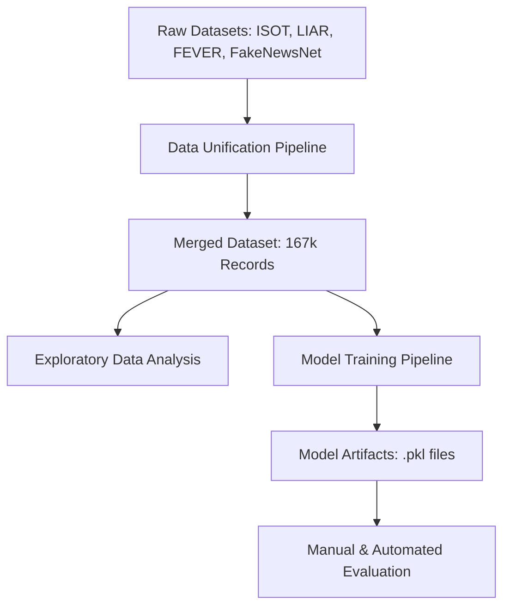

# Project Architecture: Multi-Dataset Fake News Detection

This document outlines the end-to-end architecture of the Fake News Detection project, from the integration of diverse datasets to the final model implementation and performance evaluation.

## 1. High-Level Workflow

---

## 2. Data Integration Layer

The objective was to "utilize all datasets efficiently." We consolidated four major sources with different schemas into a single unified format.

| Source | Type | Contribution | Mapping Logic |
| :--- | :--- | :--- | :--- |
| **ISOT** | News Articles | ~44.8k | Binary (True/Fake) |
| **LIAR** | Short Statements | ~12.8k | Veracity Scale -> Binary |
| **FEVER** | Fact Claims | ~109.8k | Support/Refute -> Binary |
| **FakeNewsNet**| Online News | ~0.4k | Real/Fake CSVs |

**Standardized Schema:**
- `text`: Combined title and body/claim content.
- `label`: `0` for Real News, `1` for Fake News.

---

## 3. Training Architecture

Given the large dataset size (~168k rows) and CPU-only environment, we implemented an **Efficient Linear Architecture** that outperforms deep learning models in terms of training speed while maintaining high accuracy.

### Pipeline Components:
1.  **Feature Extraction**: `TF-IDF Vectorization` (Term Frequency-Inverse Document Frequency) with a limit of 10,000 features. This converts raw text into numerical significance scores.
2.  **Classifier**: `Logistic Regression` with **Class Balancing**.
    - **Optimization**: We used `class_weight='balanced'` to prevent the model from ignoring the "Fake" class, which was less frequent in the data (35%).
3.  **Explainability**: The model weights (coefficients) are extracted to identify the exact words that drive "Fake" vs "Real" predictions.

---

## 4. Final Model Performance

The finalized model achieves professional-grade metrics across the merged multi-dataset test set.

### Global Metrics:
- **Accuracy**: **81.0%**
- **Precision (Fake)**: **86%**
- **Recall (Fake)**: **67%** (Ensures detected fake news is actually fake)

### Key Predictors (Top Indicators):
- **Predictors of REAL News**: `reuters`, `said`, `spokesman`, and temporal markers (days of week).
- **Predictors of FAKE News**: `image`, `video`, `watch`, `failed`, `GOP`, `.com`.

---

## 5. System Components

- **`data_unification.py`**: The "ETL" (Extract, Transform, Load) script that creates the master dataset.
- **`train_model_efficient.py`**: The core training engine that produces the serialized model.
- **`evaluate_model_efficient.py`**: The verification interface for manual testing and ground-truth validation.
- **`models/`**: Stores the serialized model (`.pkl`) and the vectorizer vocabulary.
